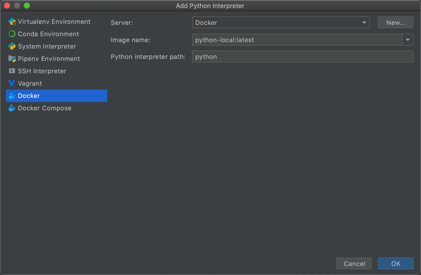
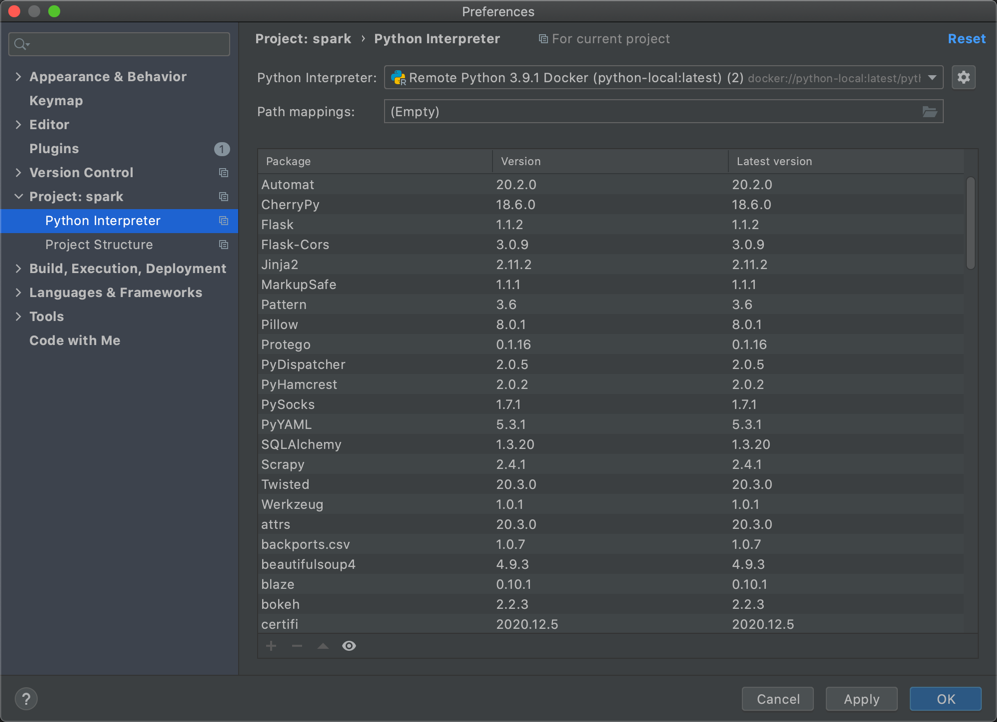

# Set up Virtual Environments in Python
In this article we review three different methods to set up virtual and remote Python development environments. These methods can be used depends on how python install on the system and project requirements.

The basic problem being addressed is one of dependencies and versions, and indirectly permissions. Imagine you have an application that needs version 1 of LibFoo, but another application requires version 2. How can you use both these libraries? If you install everything into your host python (e.g. python3.8) it’s easy to end up in a situation where two packages have conflicting requirements.

Or more generally, what if you want to install an application and leave it be? If an application works, any change in its libraries or the versions of those libraries can break the application. Also, what if you can’t install packages into the global site-packages directory, due to not having permissions to change the host python environment?

### **1. Using venv and virtualenv packages**

virtualenv is a tool to create isolated Python environments. Since Python 3.3, a subset of it has been integrated into the standard library under the venv module. The venv module does not offer all features of this library, to name just a few more prominent:

* is slower (by not having the app-data seed method),

* cannot create virtual environments for arbitrarily installed python versions (and automatically discover these),

* is not upgrade-able via pip,

* does not have as rich programmatic API (describe virtual environments without creating them).

using `--help` parameter you can see all of the mandatory and optional arguments for `virtualvenv` cli:

```shell
usage: virtualenv [--version] [--with-traceback] [-v | -q] [--read-only-app-data] [--app-data APP_DATA] [--reset-app-data] [--upgrade-embed-wheels] [--discovery {builtin}] [-p py] [--creator {builtin,cpython3-posix,venv}]
                  [--seeder {app-data,pip}] [--no-seed] [--activators comma_sep_list] [--clear] [--no-vcs-ignore] [--system-site-packages] [--symlinks | --copies] [--no-download | --download] [--extra-search-dir d [d ...]] [--pip version]
                  [--setuptools version] [--wheel version] [--no-pip] [--no-setuptools] [--no-wheel] [--no-periodic-update] [--symlink-app-data] [--prompt prompt] [-h]
                  dest

optional arguments:
  --version                     display the version of the virtualenv package and its location, then exit
  --with-traceback              on failure also display the stacktrace internals of virtualenv (default: False)
  --read-only-app-data          use app data folder in read-only mode (write operations will fail with error) (default: False)
  --app-data APP_DATA           a data folder used as cache by the virtualenv (default: /Users/jahromik/Library/Application Support/virtualenv)
  --reset-app-data              start with empty app data folder (default: False)
  --upgrade-embed-wheels        trigger a manual update of the embedded wheels (default: False)
  -h, --help                    show this help message and exit

verbosity:
  verbosity = verbose - quiet, default INFO, mapping => CRITICAL=0, ERROR=1, WARNING=2, INFO=3, DEBUG=4, NOTSET=5

  -v, --verbose                 increase verbosity (default: 2)
  -q, --quiet                   decrease verbosity (default: 0)

discovery:
  discover and provide a target interpreter

  --discovery {builtin}         interpreter discovery method (default: builtin)
  -p py, --python py            interpreter based on what to create environment (path/identifier) - by default use the interpreter where the tool is installed - first found wins (default: [])

creator:
  options for creator builtin

  --creator {builtin,cpython3-posix,venv}
                                create environment via (builtin = cpython3-posix) (default: builtin)
  dest                          directory to create virtualenv at
  --clear                       remove the destination directory if exist before starting (will overwrite files otherwise) (default: False)
  --no-vcs-ignore               don't create VCS ignore directive in the destination directory (default: False)
  --system-site-packages        give the virtual environment access to the system site-packages dir (default: False)
  --symlinks                    try to use symlinks rather than copies, when symlinks are not the default for the platform (default: True)
  --copies, --always-copy       try to use copies rather than symlinks, even when symlinks are the default for the platform (default: False)

seeder:
  options for seeder app-data

  --seeder {app-data,pip}       seed packages install method (default: app-data)
  --no-seed, --without-pip      do not install seed packages (default: False)
  --no-download, --never-download
                                pass to disable download of the latest pip/setuptools/wheel from PyPI (default: True)
  --download                    pass to enable download of the latest pip/setuptools/wheel from PyPI (default: False)
  --extra-search-dir d [d ...]  a path containing wheels to extend the internal wheel list (can be set 1+ times) (default: [])
  --pip version                 version of pip to install as seed: embed, bundle or exact version (default: bundle)
  --setuptools version          version of setuptools to install as seed: embed, bundle or exact version (default: bundle)
  --wheel version               version of wheel to install as seed: embed, bundle or exact version (default: bundle)
  --no-pip                      do not install pip (default: False)
  --no-setuptools               do not install setuptools (default: False)
  --no-wheel                    do not install wheel (default: False)
  --no-periodic-update          disable the periodic (once every 14 days) update of the embedded wheels (default: False)
  --symlink-app-data            symlink the python packages from the app-data folder (requires seed pip>=19.3) (default: False)

activators:
  options for activation scripts

  --activators comma_sep_list   activators to generate - default is all supported (default: bash,cshell,fish,powershell,python,xonsh)
  --prompt prompt               provides an alternative prompt prefix for this environment (default: None)
```

Here we review few scenarios for creating virtual environment using `virtualvenv` cli:
#### **Example 1**:
Below command will generate a virtual environment base on the default or the current active environment in the system:
```shell
>>> virtualenv venv
```
To activate the virtual environment in Mac use below command:
```shell
>>> source venv/bin/activate
```
For windows the following command can be used:
```shell
>>> venv\Scripts\activate 
```
In both windows and Mac the virtual environment can be deactivated using below command
```shell
>>> deactivate
```
#### **Example 2**:
Let consider the a situation that both Python 2.7 and Python 3.6 are installed. Below command will generate a  virtual environment base on Python 2.7:

```shell
>>> virtualenv venv --clear --python python2
```
In case if virtualenv cannot find the the path to Python 2.7, we can pass the Python 2.7 path as an argument to the virtualenv cli:
```shell
>>> virtualenv venv --clear --python /usr/bin/python2.7
```
#### **Example 3**:
Similar to `virtualenv` cli, `venv` library in Python 3 can be used to generate the virtual environment. `venv` will generate the virtual environment based of the version of the Python that the `venv` gets called from.

```shell
>>> python -m venv venv_destination 
```

Note: if you want to manage all of your virtual environment in one place `virtualenvwrapper` provides a set of extensions to virtualenv tool that can be used to manage all of the virtual environments in one place. Here is the link to the
[virtualenvwrapper home page](https://virtualenvwrapper.readthedocs.io/en/latest/).

### **2. Using conda CLI**
Fair number of data scientists use Anaconda for developing their projects. In this case `conda` cli can be used to manage the virtual environments. With conda, you can create, export, list, remove, and update environments that have different versions of Python and/or packages installed in them. Switching or moving between environments is called activating the environment. You can also share an environment file.

```shell
usage: conda create [-h] [--clone ENV] [-n ENVIRONMENT | -p PATH] [-c CHANNEL] [--use-local] [--override-channels] [--repodata-fn REPODATA_FNS]
                    [--strict-channel-priority] [--no-channel-priority] [--no-deps | --only-deps] [--no-pin] [--copy] [-C] [-k] [--offline] [-d]
                    [--json] [-q] [-v] [-y] [--download-only] [--show-channel-urls] [--file FILE] [--no-default-packages] [--dev]
                    [package_spec [package_spec ...]]

Create a new conda environment from a list of specified packages. To use the created environment, use 'conda activate envname' look in that directory first.  This command requires either the -n NAME or -p PREFIX option.

Options:

positional arguments:
  package_spec          Packages to install or update in the conda environment.

optional arguments:
  -h, --help            Show this help message and exit.
  --clone ENV           Path to (or name of) existing local environment.
  --file FILE           Read package versions from the given file. Repeated file specifications can be passed (e.g. --file=file1 --file=file2).
  --dev                 Use `sys.executable -m conda` in wrapper scripts instead of CONDA_EXE. This is mainly for use during tests where we test new
                        conda source against old Python versions.

Target Environment Specification:
  -n ENVIRONMENT, --name ENVIRONMENT
                        Name of environment.
  -p PATH, --prefix PATH
                        Full path to environment location (i.e. prefix).

Channel Customization:
  -c CHANNEL, --channel CHANNEL
                        Additional channel to search for packages. These are URLs searched in the order they are given (including local directories
                        using the 'file://' syntax or simply a path like '/home/conda/mychan' or '../mychan'). Then, the defaults or channels from
                        .condarc are searched (unless --override-channels is given). You can use 'defaults' to get the default packages for conda.
                        You can also use any name and the .condarc channel_alias value will be prepended. The default channel_alias is
                        http://conda.anaconda.org/.
  --use-local           Use locally built packages. Identical to '-c local'.
  --override-channels   Do not search default or .condarc channels. Requires --channel.
  --repodata-fn REPODATA_FNS
                        Specify name of repodata on remote server. Conda will try whatever you specify, but will ultimately fall back to
                        repodata.json if your specs are not satisfiable with what you specify here. This is used to employ repodata that is reduced
                        in time scope. You may pass this flag more than once. Leftmost entries are tried first, and the fallback to repodata.json is
                        added for you automatically.

Solver Mode Modifiers:
  --strict-channel-priority
                        Packages in lower priority channels are not considered if a package with the same name appears in a higher priority channel.
  --no-channel-priority
                        Package version takes precedence over channel priority. Overrides the value given by `conda config --show channel_priority`.
  --no-deps             Do not install, update, remove, or change dependencies. This WILL lead to broken environments and inconsistent behavior. Use
                        at your own risk.
  --only-deps           Only install dependencies.
  --no-pin              Ignore pinned file.
  --no-default-packages
                        Ignore create_default_packages in the .condarc file.

Package Linking and Install-time Options:
  --copy                Install all packages using copies instead of hard- or soft-linking.

Networking Options:
  -C, --use-index-cache
                        Use cache of channel index files, even if it has expired.
  -k, --insecure        Allow conda to perform "insecure" SSL connections and transfers. Equivalent to setting 'ssl_verify' to 'false'.
  --offline             Offline mode. Don't connect to the Internet.

Output, Prompt, and Flow Control Options:
  -d, --dry-run         Only display what would have been done.
  --json                Report all output as json. Suitable for using conda programmatically.
  -q, --quiet           Do not display progress bar.
  -v, --verbose         Can be used multiple times. Once for INFO, twice for DEBUG, three times for TRACE.
  -y, --yes             Do not ask for confirmation.
  --download-only       Solve an environment and ensure package caches are populated, but exit prior to unlinking and linking packages into the
                        prefix.
  --show-channel-urls   Show channel urls. Overrides the value given by `conda config --show show_channel_urls`.

Examples:

    conda create -n myenv sqlite

```

Here are few examples of creating virtual environment using `conda`:

**Examples**
1. To create an environment:
```shell
>>> conda create --name myenv
```
This creates the myenv environment in `/envs/`. No packages will be installed in this environment.
2. To create an environment with a specific version of Python:
```shell
>>> conda create -n myenv python=3.6
```
3. To create an environment with a specific version of Python and multiple packages:

```shell
>>> conda create -n myenv python=3.6 scipy=0.15.0 astroid babel
```

4. Create the environment from the `environment.yml` file:
```shell
>>> conda env create -f environment.yml
```
Where `environment.yml` is:
```yaml
name: myenv
dependencies:
  - python=3.6   # or 2.7
  - bokeh=0.9.2
  - numpy=1.9.*
  - nodejs=0.10.*
  - flask
```
[Here you can find more information about environment yml files](https://docs.conda.io/projects/conda/en/latest/user-guide/tasks/manage-environments.html#create-env-file-manually)

5. Create the environment in `/tmp/test-env`:
```shell
>>> conda create --prefix /tmp/test-env python=3.6
```

6. Get list of installed environments:
```shell
>>> conda env list
```

7. Activate environment:
```shell
>>> conda activate environment-name
```

8. Deactivate environment:
```shell
>>> conda deactivate
```

9. Remove environment:
```shell
>>> conda env remove --name environment-name
```
### **3. Using Docker Images**
It is possible to create a Python development environment using Docker and Docker images. In this case you may need an IDE that supports Python development with docker. This method might be a bit more complex than the other two as you need to have some preliminary knowledge about docker. Here is an example of remote python environment in PyCharm professional using Python docker images and containers.

### **Example**

Below steps show how we can create a sample python development environment in PyCharm professional using docker.
1. create file `requirements.txt` which has list of packages that you new to installed in the docker container.
```python
numpy
scipy
matplotlib
pandas
sympy
Seaborn
statsmodels
scikit-learn
SQLAlchemy
pyzmq
jinja2
tornado
nltk
pattern
gensim
Scrapy
tweepy
bokeh
networkx
requests
blaze
regex
nose
psycopg2
textblob
```
2. Create a `Dockerfile` to create an image from python official docker image and includes packages in `requirements.txt`.
```Dockerfile
FROM python:3.9.1
WORKDIR /src/
COPY requirements.txt /src
RUN pip install -r requirements.txt --no-cache-dir
```
3. Build the docker image from `Dockerfile` using docker cli.
```shell
>>> docker build . -t image-name
```
5. For Windows, right-click the Docker whale icon, choose Settings from the context menu, and in the General page select the Expose daemon... checkbox:


4. In the Settings/Preferences dialog, select Project <project name> | Python Interpreter. Click the  icon and select Add.

5. In the dialog that opens, select the Docker option, from the drop-down lists select the Docker server (if the server is missing, click New...), and specify the image name.

6. In the dialog that opens, select the Docker option, from the drop-down lists select the Docker server (if the server is missing, click New...), and specify the image name.

7. As a result, in the Settings dialog, you should see something like this:


### **4. Using pipenv**
Pipenv is a tool that aims to bring the best of all packaging worlds (bundler, composer, npm, cargo, yarn, etc.) to the Python world. 

The problems that Pipenv seeks to solve are multi-faceted:

* You no longer need to use pip and virtualenv separately. They work together.
* Managing a requirements.txt file can be problematic, so Pipenv uses the upcoming `Pipfile` and `Pipfile.lock` instead, which is superior for basic use cases.
* Hashes are used everywhere, always. Security. Automatically expose security vulnerabilities.
* Give you insight into your dependency graph (e.g. $ pipenv graph).
* Streamline development workflow by loading .env files.

This tool is basically a combination of `virtualenv` and `pip`.  This tool is supported by the PyCharm IDE. A comprehensive review of this tool with examples were posted [here](https://realpython.com/pipenv-guide/).

```shell
Usage: pipenv [OPTIONS] COMMAND [ARGS]...

Options:
  --where                         Output project home information.
  --venv                          Output virtualenv information.
  --py                            Output Python interpreter information.
  --envs                          Output Environment Variable options.
  --rm                            Remove the virtualenv.
  --bare                          Minimal output.
  --completion                    Output completion (to be executed by the
                                  shell).

  --man                           Display manpage.
  --support                       Output diagnostic information for use in
                                  GitHub issues.

  --site-packages / --no-site-packages
                                  Enable site-packages for the virtualenv.
                                  [env var: PIPENV_SITE_PACKAGES]

  --python TEXT                   Specify which version of Python virtualenv
                                  should use.

  --three / --two                 Use Python 3/2 when creating virtualenv.
  --clear                         Clears caches (pipenv, pip, and pip-tools).
                                  [env var: PIPENV_CLEAR]

  -v, --verbose                   Verbose mode.
  --pypi-mirror TEXT              Specify a PyPI mirror.
  --version                       Show the version and exit.
  -h, --help                      Show this message and exit.


Usage Examples:
   Create a new project using Python 3.7, specifically:
   $ pipenv --python 3.7

   Remove project virtualenv (inferred from current directory):
   $ pipenv --rm

   Install all dependencies for a project (including dev):
   $ pipenv install --dev

   Create a lockfile containing pre-releases:
   $ pipenv lock --pre

   Show a graph of your installed dependencies:
   $ pipenv graph

   Check your installed dependencies for security vulnerabilities:
   $ pipenv check

   Install a local setup.py into your virtual environment/Pipfile:
   $ pipenv install -e .

   Use a lower-level pip command:
   $ pipenv run pip freeze

Commands:
  check      Checks for PyUp Safety security vulnerabilities and against PEP
             508 markers provided in Pipfile.

  clean      Uninstalls all packages not specified in Pipfile.lock.
  graph      Displays currently-installed dependency graph information.
  install    Installs provided packages and adds them to Pipfile, or (if no
             packages are given), installs all packages from Pipfile.

  lock       Generates Pipfile.lock.
  open       View a given module in your editor.
  run        Spawns a command installed into the virtualenv.
  scripts    Lists scripts in current environment config.
  shell      Spawns a shell within the virtualenv.
  sync       Installs all packages specified in Pipfile.lock.
  uninstall  Uninstalls a provided package and removes it from Pipfile.
  update     Runs lock, then sync.

```
  
## More Contents
### To read
1. [Virtualenv Documentation](https://virtualenv.pypa.io/en/latest/)
2. [Manage your Python Virtual Environment with Conda
](https://towardsdatascience.com/manage-your-python-virtual-environment-with-conda-a0d2934d5195)
3. [Pipenv: A Guide to the New Python Packaging Tool](https://realpython.com/pipenv-guide/)
4. [Python Environment 101](https://towardsdatascience.com/python-environment-101-1d68bda3094d)
5. [Managing Multiple Python Versions With pyenv](https://realpython.com/intro-to-pyenv/)
6. [Pyenv project in GitHub](https://github.com/pyenv/pyenv)
### To watch
1. [Pipenv Crash Course](https://www.youtube.com/watch?v=6Qmnh5C4Pmo)
2. [How to Use Virtual Environments with the Built-In venv Module (Windows)](https://www.youtube.com/watch?v=APOPm01BVrk)
3. [How to Use Virtual Environments with the Built-In venv Module](https://www.youtube.com/watch?v=Kg1Yvry_Ydk)


