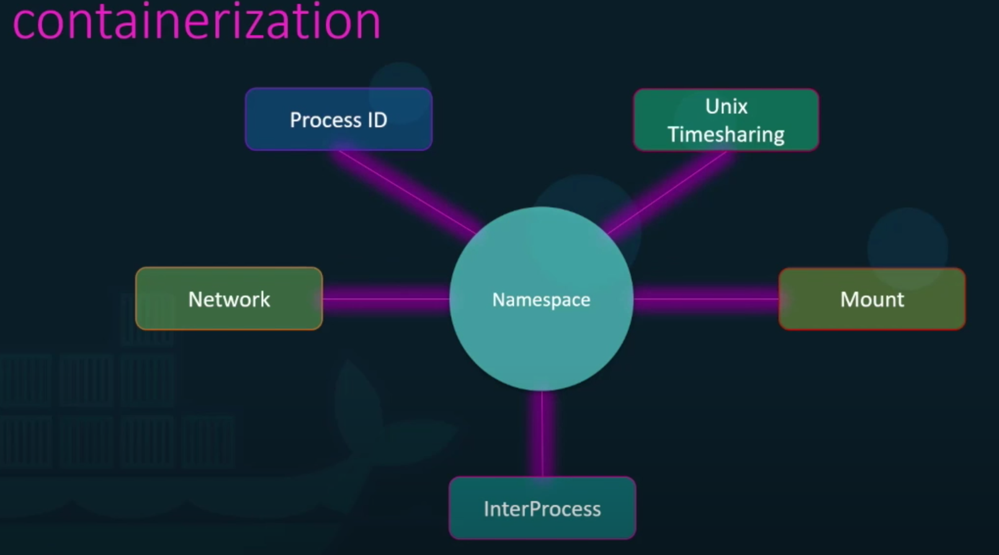

## Container and Docker

Before we start reviewing Docker, we need to take a look at the concept of Infrastructure as a service (IaaS), Platform as a service (PaaS) and Software as a service (SaaS) as docker belongs to PaaS category. Also, we review the history of containers.

### Infrastructure as a service (IaaS)

IaaS, is a step away from on-premises infrastructure. It’s a pay-as-you-go service where a third party provides you with infrastructure services, like storage and virtualization, as you need them, via a cloud, through the internet. 

As the user, you are responsible for the operating system and any data, applications, middleware, and runtimes, but a provider gives you access to, and management of, the network, servers, virtualization, and storage you need. 

### Platform as a service (PaaS)

PaaS is another step further from full, on-premise infrastructure management. It is where a provider hosts the hardware and software on its own infrastructure and delivers this platform to the user as an integrated solution, solution stack, or service through an internet connection.

Primarily useful for developers and programmers, PaaS allows the user to develop, run, and manage their own apps without having to build and maintain the infrastructure or platform usually associated with the process. 

### Software as a service (SaaS)
SaaS, also known as cloud application services, is the most comprehensive form of cloud computing services, delivering an entire application that is managed by a provider, via a web browser. 

Software updates, bug fixes, and general software maintenance are handled by the provider and the user connects to the app via a dashboard or API. There’s no installation of the software on individual machines and group access to the program is smoother and more reliable. 

## Docker

Docker is a set of platform as a service (PaaS) products that use OS-level virtualization to deliver software in packages called containers. Containers are isolated from one another and bundle their own software, libraries and configuration files; they can communicate with each other through well-defined channels. All containers are run by a single operating system kernel and therefore use fewer resources than virtual machines.

### History

Docker Inc. was founded by **Solomon Hykes and Sebastien Pahl** during the Y Combinator Summer 2010 startup incubator group and launched in 2011. Hykes started the Docker project in France as an internal project within dotCloud, a PaaS company.

Docker debuted to the public in Santa Clara at PyCon in 2013. It was released as open-source in March 2013. At the time, it used LXC as its default execution environment. One year later, with the release of version 0.9, Docker replaced LXC with its own component, which was written in the Go programming language.

In 2017, Docker created the Moby project for open research and development.

### Container

A container is a standard unit of software that packages up code and all its dependencies so the application runs quickly and reliably from one computing environment to another. A Docker container image is a lightweight, standalone, executable package of software that includes everything needed to run an application: code, runtime, system tools, system libraries and settings.

### Container Vs. Hypervisor

### Docker architecture

Docker uses a client-server architecture. The Docker client talks to the Docker daemon, which does the heavy lifting of building, running, and distributing your Docker containers. The Docker client and daemon can run on the same system, or you can connect a Docker client to a remote Docker daemon. The Docker client and daemon communicate using a REST API, over UNIX sockets or a network interface.

### Docker Engine

Docker Engine is a client-server application with these major components:
* A server which is a type of long-running program called a daemon process.
* A REST API which specifies interfaces that programs can use to talk to the daemon and instruct it what to do.
* A command line interface (CLI) client (the docker command).

#### Components
The Docker software as a service offering consists of three components:

* Software: The Docker daemon, called dockerd, is a persistent process that manages Docker containers and handles container objects. The daemon listens for requests sent via the Docker Engine API. The Docker client program, called docker, provides a command-line interface that allows users to interact with Docker daemons.
* Objects: Docker objects are various entities used to assemble an application in Docker. The main classes of Docker objects are images, containers, and services.
    * A Docker container is a standardized, encapsulated environment that runs applications. A container is managed using the Docker API or CLI.
    * A Docker image is a read-only template used to build containers. Images are used to store and ship applications.
    * A Docker service allows containers to be scaled across multiple Docker daemons. The result is known as a swarm, a set of cooperating daemons that communicate through the Docker API.
* Registries: A Docker registry is a repository for Docker images. Docker clients connect to registries to download ("pull") images for use or upload ("push") images that they have built. Registries can be public or private. Two main public registries are Docker Hub and Docker Cloud. Docker Hub is the default registry where Docker looks for images. Docker registries also allow the creation of notifications based on events.

#### Tools
* Docker Compose is a tool for defining and running multi-container Docker applications. It uses YAML files to configure the application's services and performs the creation and start-up process of all the containers with a single command. The docker-compose CLI utility allows users to run commands on multiple containers at once, for example, building images, scaling containers, running containers that were stopped, and more. Commands related to image manipulation, or user-interactive options, are not relevant in Docker Compose because they address one container. The docker-compose.yml file is used to define an application's services and includes various configuration options. For example, the build option defines configuration options such as the Dockerfile path, the command option allows one to override default Docker commands, and more. The first public beta version of Docker Compose (version 0.0.1) was released on December 21, 2013. The first production-ready version (1.0) was made available on October 16, 2014.
* Docker Swarm provides native clustering functionality for Docker containers, which turns a group of Docker engines into a single virtual Docker engine. In Docker 1.12 and higher, Swarm mode is integrated with Docker Engine. The docker swarm CLI utility allows users to run Swarm containers, create discovery tokens, list nodes in the cluster, and more. The docker node CLI utility allows users to run various commands to manage nodes in a swarm, for example, listing the nodes in a swarm, updating nodes, and removing nodes from the swarm. Docker manages swarms using the Raft consensus algorithm. According to Raft, for an update to be performed, the majority of Swarm nodes need to agree on the update.

### How Docker Works under the hood

## More Contents
### To read
1. [A Brief History of Containers: From the 1970s Till Now](https://blog.aquasec.com/a-brief-history-of-containers-from-1970s-chroot-to-docker-2016)
2. [Linux namespaces](https://en.wikipedia.org/wiki/Linux_namespaces#:~:text=Namespaces%20are%20a%20fundamental%20aspect,type%2C%20used%20by%20all%20processes.)
3. [Under the hood: understanding docker Containers and images](https://medium.com/codeengineer/understanding-docker-containers-and-images-af40f229ecb3)
4. [Docker official documentation](https://docs.docker.com/)
5. [A Beginner-Friendly Introduction to Containers, VMs and Docker](https://medium.com/free-code-camp/a-beginner-friendly-introduction-to-containers-vms-and-docker-79a9e3e119b)

### To watch
1. [Docker Tutorial for Beginners - A Full DevOps Course on How to Run Applications in Containers](https://www.youtube.com/watch?v=fqMOX6JJhGo)
2. [Docker and Kubernetes Tutorial](https://www.youtube.com/watch?v=bhBSlnQcq2k)
### Cheat Sheets
1. [Docker Cheat Sheet](https://www.docker.com/sites/default/files/d8/2019-09/docker-cheat-sheet.pdf)
2. [The Ultimate Docker Cheat Sheet](https://dockerlabs.collabnix.com/docker/cheatsheet/)