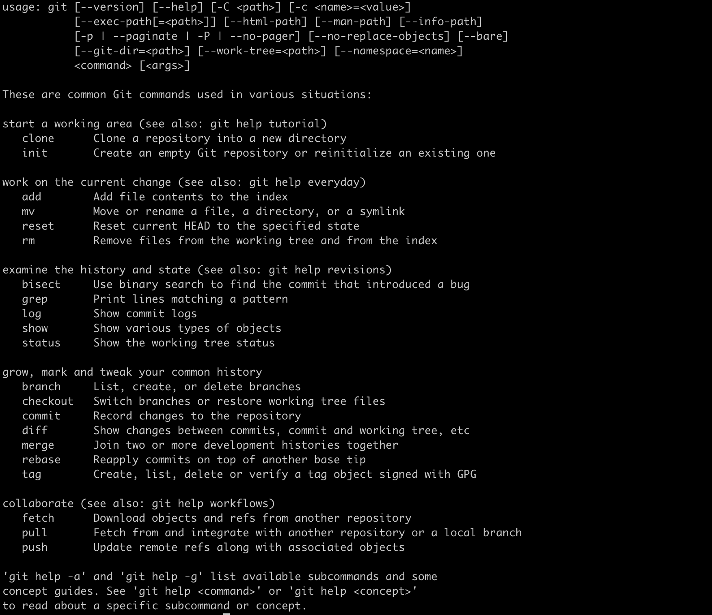

# Version Control Systems and Git

In this document we briefly review the version control history and after that we review the git and remote repository services (Github is particular)

## Version control history
1. **Stand-alone and file-focused**
    - SCCS, 1972, Unix Only
    - RCS, 1982, cross-platform, text only

    
2. **Centralized**
    - CVS, 1986, first central reoisitory, file-focused
    - Perforce, 1995
    - Subversion, 2000, track directory structure
    - Microsoft Team Foundation Server, 2010

    
3. **Distributed**
    - Git, 2005, created by Linus Torvalds after the change to the BitKeeper policy
    - Mercurial, 2005, same as Git created to respond to the change in BitKeeper

    

Linus Torvalds wanted a distributed system that he could use like BitKeeper, but none of the available free systems met his needs. Torvalds cited an example of a source-control management system needing 30 seconds to apply a patch and update all associated metadata, and noted that this would not scale to the needs of Linux kernel development, where synchronizing with fellow maintainers could require 250 such actions at once. For his design criterion, he specified that patching should take no more than three seconds, and added three more points:

1. Take Concurrent Versions System (CVS) as an example of what not to do; if in doubt, make the exact opposite decision.
2. Support a distributed, BitKeeper-like workflow.
3. Include very strong safeguards against corruption, either accidental or malicious.

As of 2018, almost 90% of the 74,000 developers surveyed by Stack Overflow prefer to use Git for version control. Git dominates all other version control systems and adoption is up almost 20% from 2017 according to the survey.

## Let's start with Git

### Git three stages
Git has three main states that your files can reside in: modified, staged, and committed:

* Modified means that you have changed the file but have not committed it to your database yet.
* Staged means that you have marked a modified file in its current version to go into your next commit snapshot.
* Committed means that the data is safely stored in your local database.

### Git common concepts

#### Git clone

Cloning a repository means developer copy the entire repository from the remote server to the local machine.  

#### Git branch

Nearly every VCS has some form of branching support. Branching means you diverge from the main line of development and continue to do work without messing with that main line. In many VCS tools, this is a somewhat expensive process, often requiring you to create a new copy of your source code directory, which can take a long time for large projects.

Some people refer to Git's branching model as its “killer feature,” and it certainly sets Git apart in the VCS community. Why is it so special? The way Git branches is incredibly lightweight, making branching operations nearly instantaneous, and switching back and forth between branches generally just as fast. Unlike many other VCSs, Git encourages workflows that branch and merge often, even multiple times in a day. Understanding and mastering this feature gives you a powerful and unique tool and can entirely change the way that you develop.

#### Git merge

Git merge will combine multiple sequences of commits into one unified history. In the most frequent use cases, git merge is used to combine two branches.

#### Git merge conflicts
Version control systems are all about managing contributions between multiple distributed authors ( usually developers ). Sometimes multiple developers may try to edit the same content. If Developer A tries to edit code that Developer B is editing a conflict may occur. To alleviate the occurrence of conflicts developers will work in separate isolated branches. The git merge command's primary responsibility is to combine separate branches and resolve any conflicting edits.

#### Git push
Pushing is how you transfer commits from your local repository to a remote repo.

#### Git remote
A remote in Git is a common repository that all team members use to exchange their changes. In most cases, such a remote repository is stored on a code hosting service like GitHub or on an internal server.

#### Pull request
Pull requests let you tell others about changes you've pushed to a branch in a repository on a remote repository. Once a pull request is opened, you can discuss and review the potential changes with collaborators and add follow-up commits before your changes are merged into the base branch.

### The Command Line
There are a lot of different ways to use Git. There are the original command-line tools, and there are many graphical user interfaces of varying capabilities. For this book, we will be using Git on the command line. For one, the command line is the only place you can run all Git commands — most of the GUIs implement only a partial subset of Git functionality for simplicity. If you know how to run the command-line version, you can probably also figure out how to run the GUI version, while the opposite is not necessarily true. Also, while your choice of graphical client is a matter of personal taste, all users will have the command-line tools installed and available.

[Installing Git Manual by Bitbucket](https://www.atlassian.com/git/tutorials/install-git)

Beside the command line, most of IDEs and Code editors have integrated version control tools. Here is some links to some these IDEs:

* [VS Code](https://code.visualstudio.com/docs/editor/versioncontrol)
* [IntelliJ](https://www.jetbrains.com/help/idea/enabling-version-control.html)
* [Pycharm](https://www.jetbrains.com/help/pycharm/enabling-version-control.html)

### Basic Git commands
To use Git, developers use specific commands to copy, create, change, and combine code. These commands can be executed directly from the command line or by using an application like GitHub Desktop or Git Kraken. Here are some common commands for using Git:

* `git init` initializes a brand new Git repository and begins tracking an existing directory. It adds a hidden subfolder within the existing directory that houses the internal data structure required for version control.
* `git clone` creates a local copy of a project that already exists remotely. The clone includes all the project’s files, history, and branches.
* `git add` stages a change. Git tracks changes to a developer’s codebase, but it’s necessary to stage and take a snapshot of the changes to include them in the project’s history. This command performs staging, the first part of that two-step process. Any changes that are staged will become a part of the next snapshot and a part of the project’s history. Staging and committing separately gives developers complete control over the history of their project without changing how they code and work.
* `git commit` saves the snapshot to the project history and completes the change-tracking process. In short, a commit functions like taking a photo. Anything that’s been staged with git add will become a part of the snapshot with git commit.
* `git status` shows the status of changes as untracked, modified, or staged.
* `git branch` shows the branches being worked on locally.
* `git merge` merges lines of development together. This command is typically used to combine changes made on two distinct branches. For example, a developer would merge when they want to combine changes from a feature branch into the main branch for deployment.
* `git pull` updates the local line of development with updates from its remote counterpart. Developers use this command if a teammate has made commits to a branch on a remote, and they would like to reflect those changes in their local environment.
* `git push` updates the remote repository with any commits made locally to a branch.

Learn more from a full reference guide to Git commands.

## GitHub
GitHub is a code hosting platform for version control and collaboration. It lets you and others work together on projects from anywhere.

This tutorial teaches you GitHub essentials like repositories, branches, commits, and Pull Requests. You’ll create your own Hello World repository and learn GitHub’s Pull Request workflow, a popular way to create and review code.

Here are some links to training for the GitHub:

* [GitHub Hello World Example](https://guides.github.com/activities/hello-world/)
* [GitHub Guides](https://guides.github.com/)

## Git Internal
Git is directed acyclic graph([Learn more about the directed acyclic graph here](https://medium.com/basecs/spinning-around-in-cycles-with-directed-acyclic-graphs-a233496d4688)).  This means the last commit always knows the information related to the commit before and this chain continue.

Git uses SHA1 to detect any changes in the files. This means Git compares the files SHA1 hashes. Once the hashes are different from each other, Git understands that the file content is modified. Git uses tree object to list the files the tree to keep the relation between directories and files. It also keeps the file contents in blobs. Here is glance at commit structure.

## Gitflow Workflow
Gitflow Workflow is a Git workflow design that was first published and made popular by Vincent Driessen at nvie. The Gitflow Workflow defines a strict branching model designed around the project release. This provides a robust framework for managing larger projects. 

.svg?cdnVersion=1310)

[Here is the link to Gitflow document in Bitbucket website](https://www.atlassian.com/git/tutorials/comparing-workflows/gitflow-workflow#:~:text=Gitflow%20Workflow%20is%20a%20Git,designed%20around%20the%20project%20release.&text=In%20addition%20to%20feature%20branches,%2C%20maintaining%2C%20and%20recording%20releases.)

## More Contents
### To read
1. [Getting Started - About Version Control](https://git-scm.com/book/en/v2/Getting-Started-About-Version-Control)
2. [The entire Pro Git book, written by Scott Chacon and Ben Straub](https://git-scm.com/book/en/v2)
3. [The Biggest Misconception About Git](https://medium.com/@gohberg/the-biggest-misconception-about-git-b2f87d97ed52)
4. [The Architecture and History of Git](https://medium.com/@willhayjr/the-architecture-and-history-of-git-a-distributed-version-control-system-62b17dd37742)
5. [10 Git Commands You Should Know](https://towardsdatascience.com/10-git-commands-you-should-know-df54bea1595c)
6. [7 Git Commands/Concepts you may do not know yet](https://medium.com/javascript-in-plain-english/7-git-commands-concepts-you-may-do-not-know-yet-d0aa9dbee7b1)
7. [5 GitHub tips for new coders](https://medium.com/free-code-camp/5-github-tips-for-new-coders-2f312689ffd5)
### To watch
1. [Tech Talk: Linus Torvalds on git](https://www.youtube.com/watch?v=4XpnKHJAok8)
2. [Git and GitHub for Beginners - Crash Course](https://www.youtube.com/watch?v=RGOj5yH7evk)
3. [Lecture 6: Version Control (git) (2020)](https://www.youtube.com/watch?v=2sjqTHE0zok)
4. [Advanced GIT for Developers - Lorna Jane Mitchell - Laracon EU 2015](https://www.youtube.com/watch?v=duqBHik7nRo)
5. [GOTO 2015 • Deep Dive into Git • Edward Thomson](https://www.youtube.com/watch?v=dBSHLb1B8sw)
6. [Git Internals - How Git Works - Fear Not The SHA!](https://www.youtube.com/watch?v=P6jD966jzlk&vl=en)
### Cheat Sheets
1. [Git cheat sheet by Bitbucket](https://www.atlassian.com/git/tutorials/atlassian-git-cheatsheet)
2. [Git cheat sheet by GitHub (1)](https://training.github.com/downloads/github-git-cheat-sheet.pdf)
3. [Git cheat sheet by GitHub (2)](https://education.github.com/git-cheat-sheet-education.pdf)
