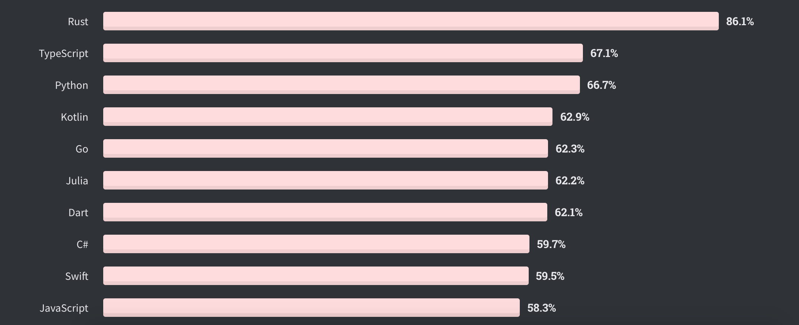
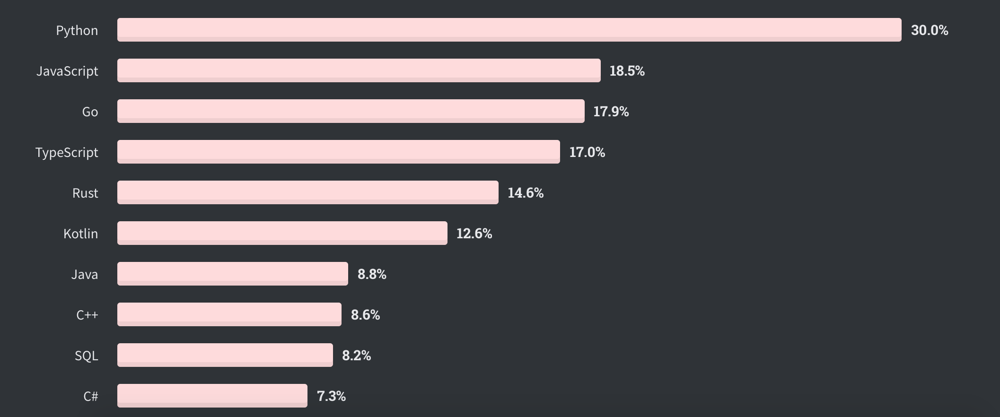

# Python

Python is an interpreted, high-level and general-purpose programming language. Created by Guido van Rossum and first released in 1991, Python's design philosophy emphasizes code readability with its notable use of significant whitespace. Its language constructs and object-oriented approach aim to help programmers write clear, logical code for small and large-scale projects.

Python is dynamically typed and garbage-collected. It supports multiple programming paradigms, including structured (particularly, procedural), object-oriented, and functional programming. Python is often described as a "batteries included" language due to its comprehensive standard library.

Python was created in the late 1980s as a successor to the ABC language. Python 2.0, released in 2000, introduced features like list comprehensions and a garbage collection system with reference counting.

## Python history

## Python among other programing languages

Python is the third beloved programing languages based on the stackoverflow website:

At the same time it classified as the most wanted language in the same survey:

## Why is Python so Popular?
* Easy to Learn and Use
* Mature and Supportive Python Community
* Support from Renowned Corporate Sponsors
* Hundreds of Python Libraries and Frameworks
* Versatility, Efficiency, Reliability, and Speed
* Big data, Machine Learning and Cloud Computing
* First-choice Language
* The Flexibility of Python Language
* Use of python in academics
* Automation 

## Why Python?
* Python is the most popular language due to the fact that it’s easier to code and understand it.
* Python is an object-oriented programming language and can be used to write functional code too.
* It is a suitable language that bridges the gaps between business and developers.
* Subsequently, it takes less time to bring a Python program to market compared to other languages such as C#/Java.
* Additionally, there are a large number of python machine learning and analytical packages.
* A large number of communities and books are available to support Python developers.
* Nearly all types of applications, ranging from forecasting analytical to UI, can be implemented in Python.
* There is no need to declare variable types. Thus it is quicker to implement a Python application.
## Why Not Python?
* Python is slower than C++, C#, Java. This is due to the lack of Just In Time optimisers in Python.
* Python syntactical white-space constraint makes it slightly difficult to implement for new coders.
* Python is not suitable for low-level systems and hardware interaction.
## How Does Python Work?
This image illustrates how python runs on our machines:

## How to install python

There are two common way for installing python interpreter. One is to download and install the pure python interpreter from the python official website. The other one is to download the Anaconda community edition (This method is recommended if you want to use python for analytics and data science). Here are the links for downloading Python and Anaconda

* [Download Python ](https://www.python.org/downloads/)
* [Getting Started with Python in VS Code](https://code.visualstudio.com/docs/python/python-tutorial)
* [Download Anaconda Individual](https://www.anaconda.com/products/individual)
* [Download PyCharm](https://www.jetbrains.com/pycharm/)
* [Virtual Environment in Python](virtual_environment.md)

## More Contents
### To read
1. [Learn Python Programming](https://www.programiz.com/python-programming)
2. [Top 10 Reasons Why Python is So Popular With Developers in 2020](https://www.upgrad.com/blog/reasons-why-python-popular-with-developers/#:~:text=The%20python%20language%20is%20one,faster%20than%20other%20programming%20languages.)
3. [Everything About Python — Beginner To Advanced](https://medium.com/fintechexplained/everything-about-python-from-beginner-to-advance-level-227d52ef32d2)
4. [Real Python Tutorials](https://realpython.com/)
5. [How to Write Beautiful Python Code With PEP 8](https://realpython.com/python-pep8/)
6. [Google Python Style Guide](https://google.github.io/styleguide/pyguide.html)
7. [Raymond Hettinger, Keynote on Concurrency](https://www.youtube.com/watch?v=9zinZmE3Ogk&t=2977s)
8. [Learn Python Programming](https://www.programiz.com/python-programming)

### To watch
1. [What is Python? Why Python is So Popular?](https://www.youtube.com/watch?v=Y8Tko2YC5hA)
2. [Python Tutorial - Python for Beginners](https://www.youtube.com/watch?v=_uQrJ0TkZlc)
3. [Learn Python - Full Course for Beginners](https://www.youtube.com/watch?v=rfscVS0vtbw)
4. [Intermediate Python Programming Course](https://www.youtube.com/watch?v=HGOBQPFzWKo)

### Cheat Sheets
1. [Python Crash Course - Cheat Sheets](https://ehmatthes.github.io/pcc/cheatsheets/README.html)
